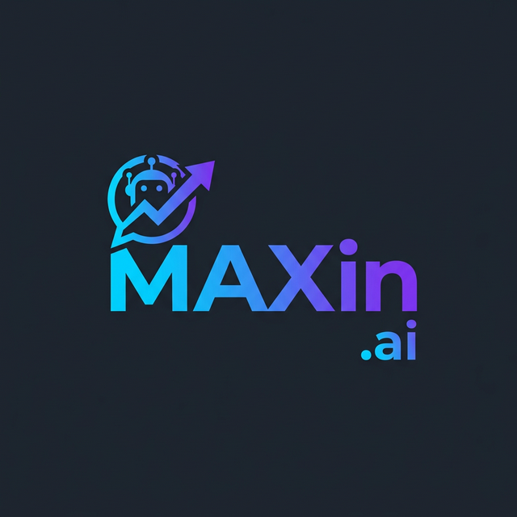

<div align="center">
  
  <h1>MAXin.ai — Tu Vendedor Virtual Inteligente</h1>
  <p>Potenciado con Inteligencia Artificial, MAXin atiende, vende y cobra por WhatsApp las 24/7 sin que tú muevas un dedo. 🚀</p>
</div>

<br/>

## 🌟 Visuales de la Plataforma

Disfruta de una experiencia premium en esta **Landing Page Mobile First**:

- 📱 **Dark Mode Nativo:** Estética premium con gradientes Cyberpunk Cían-Magenta.
- 💬 **Auto-Chat Animado:** Simulación de chat de WhatsApp en tiempo real.
- 🌎 **Adaptación Regional:** Tres escenarios demostrativos para Perú y Argentina.
- 📊 **Dashboard Integrado:** Reportes interactivos, clientes VIP e inteligencia de negocios.
- 🔒 **Trust-first:** Sección visual única sobre el sistema Anti-Estafas.

## 🚀 Características del Proyecto
- **100% Vanilla Tech Stack:** HTML5, CSS3, JavaScript puro. Sin frameworks pesados.
- **Rendimiento ultra-rápido:** Zero dependencias, carga en milisegundos.
- **Micro-animaciones CSS:** Efectos `scroll`, `parallax`, y `hover` state-of-the-art.
- **Conexión a Google Sheets:** El formulario contacta directo a un backend serverless usando `iframe` oculto + Google Forms, almacenando datos como CRM directamente en un archivo Excel / Sheets de manera instantánea.

## 💻 Desarrollo Local

Solo necesitas un servidor HTTP sencillo.

```bash
# Instala http-server si no lo tienes
npm install -g http-server

# Corre el servidor
http-server .
```

O si usas Python:
```bash
python -m http.server 8000
```
Abre en tu navegador `http://localhost:8000`

---

### 💳 Nuestros Planes
- 🔥 **Emprendedor:** S/30 mes
- 🚀 **Negocio Pro:** S/60 mes *(El más popular)*
- 💼 **Empresa:** S/100 mes

Todos los planes incluyen **Sistema de Prevención Integral de Estafas SHA-256** exclusivo del mercado y prueba gratis de 30 días. Tu éxito está garantizado.

<br/>
<div align="center">
  <p>De emprendedores para emprendedores. 🇵🇪 🇦🇷<br/>
  <b>Porque en MAXin.ai las ventas nunca duermen.</b></p>
</div>
